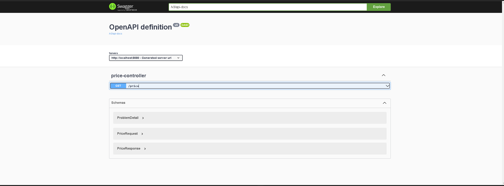
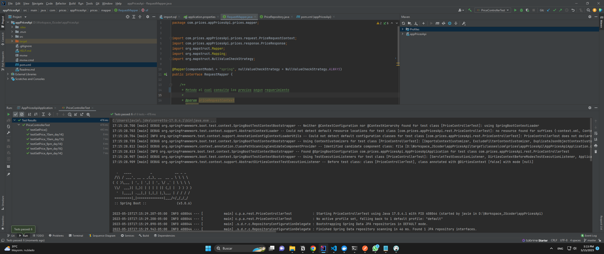
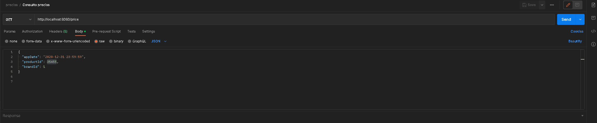
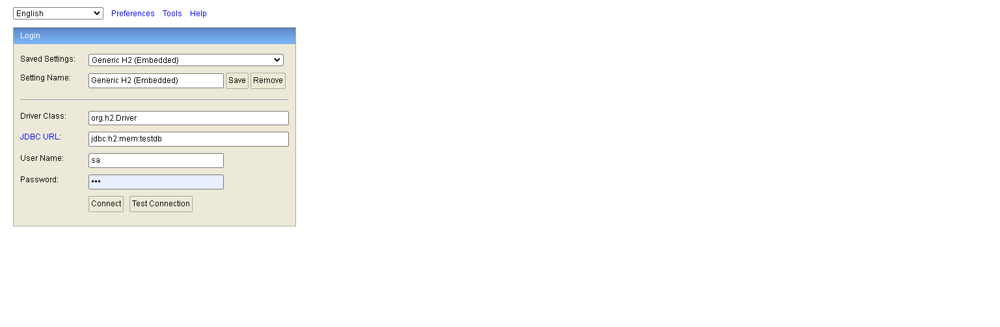
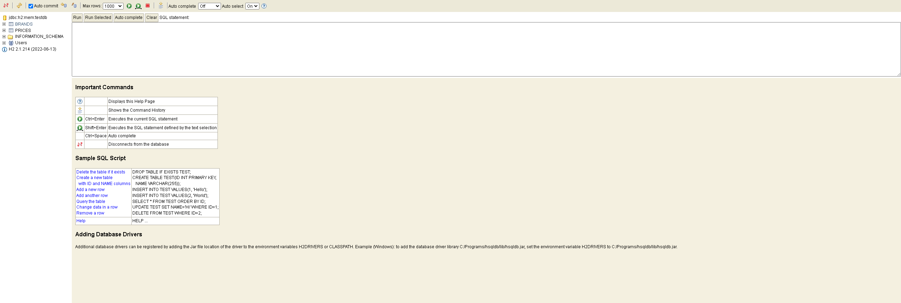
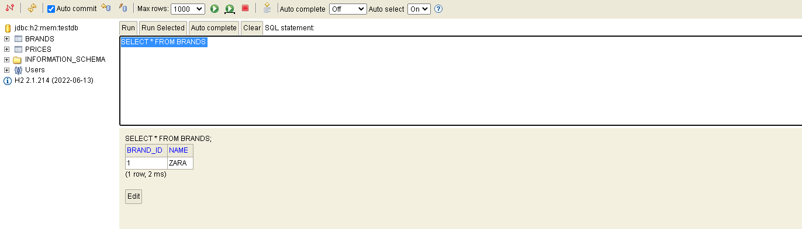
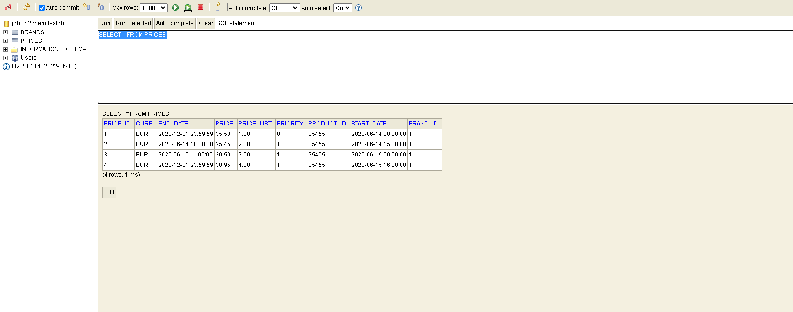
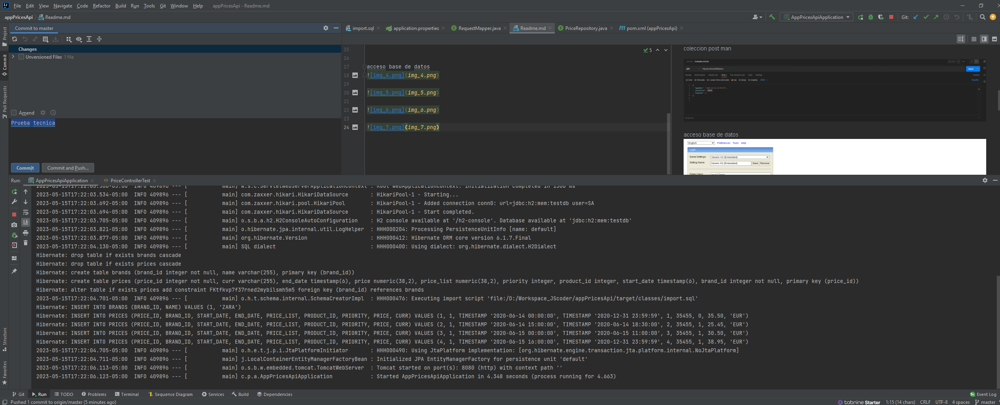

documentacion 
http://localhost:8080/swagger-ui/index.html#/

ejecucion test cases 

coleccion post man

acceso base de datos 

ejecucion proyecto

curl --location --request GET 'http://localhost:8080/price?appDate=2023-05-26T17%3A05%3A45&productId=35455&brandId=1' \
--header 'Content-Type: application/json'

